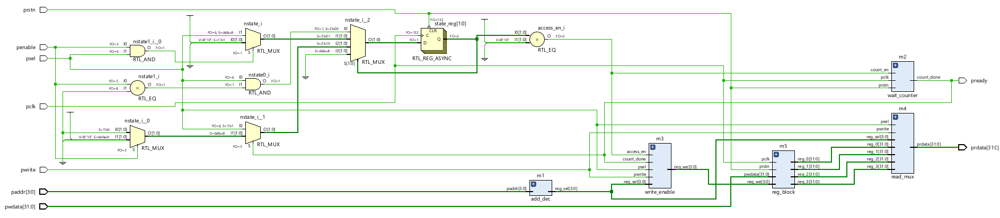
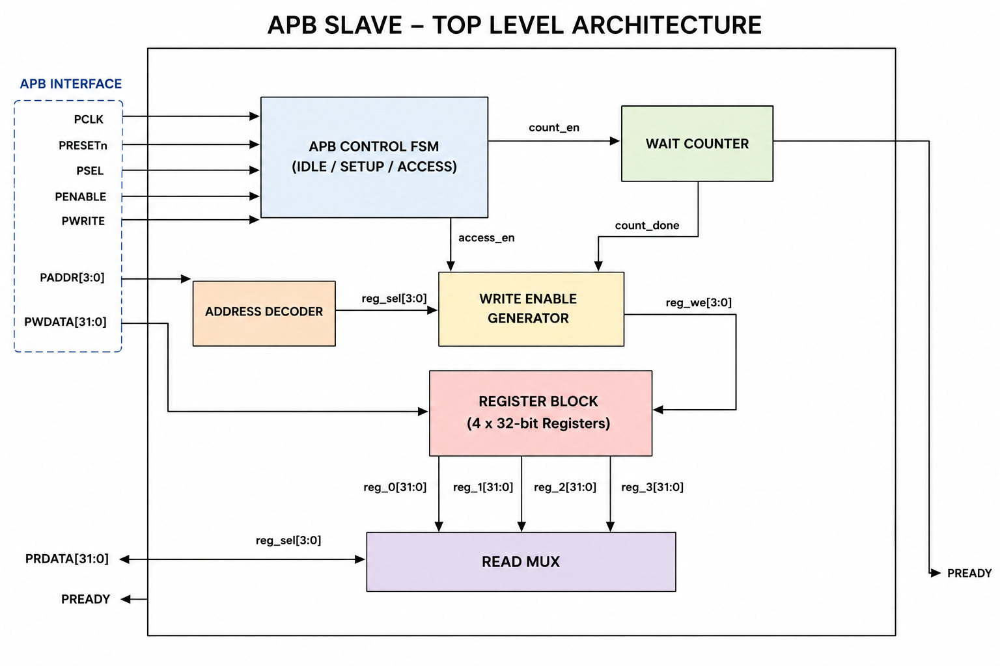
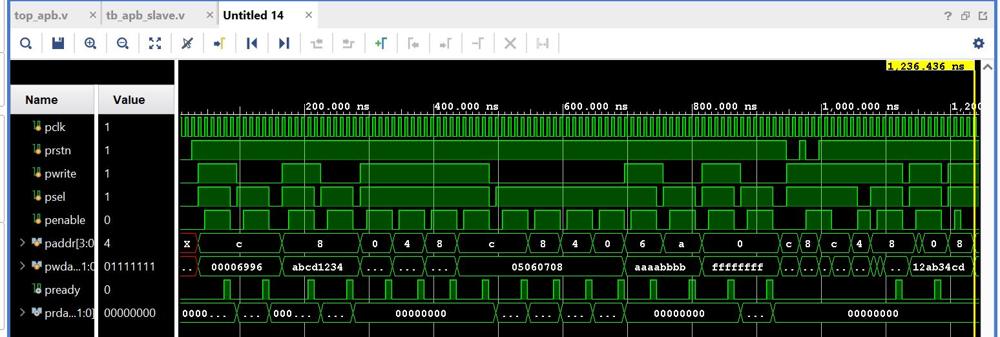
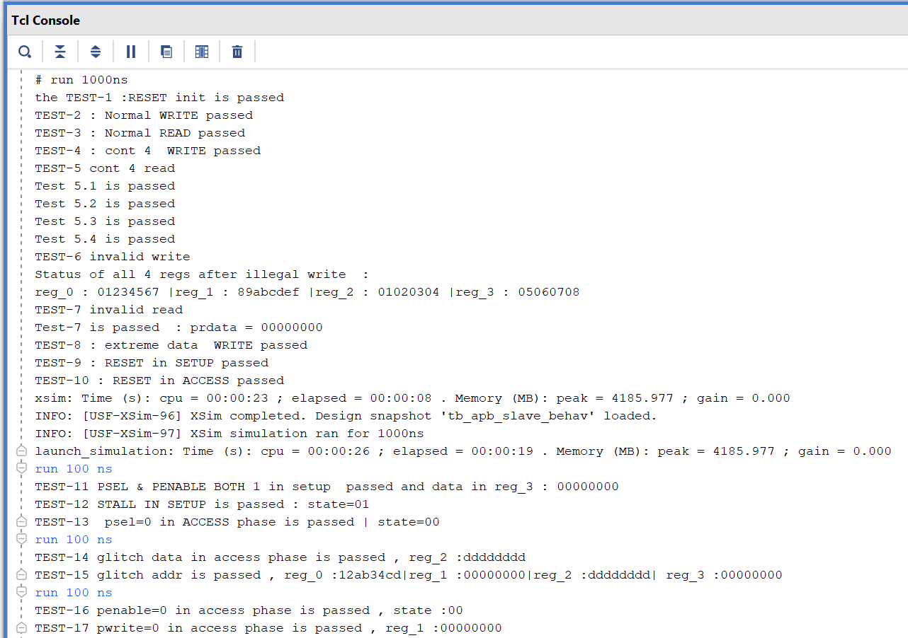

# APB Slave in Verilog

## Overview
This project implements a simple APB slave in Verilog with a 4-register internal register bank.

The design supports:
- APB write transactions
- APB read transactions
- address decoding for 4 registers
- fixed wait-state generation using a counter
- `PREADY` assertion after the wait period

The design was simulated in **Vivado/XSim** using a custom Verilog testbench.

---

## RTL Schematic

## Architecture 

---

## Interface

### Inputs
- `pclk`   : APB clock
- `prstn`  : active-low reset
- `pwrite` : write/read control (`1` = write, `0` = read)
- `psel`   : slave select
- `penable`: APB enable
- `paddr`  : 4-bit address
- `pwdata` : 32-bit write data

### Outputs
- `pready` : transfer completion signal
- `prdata` : 32-bit read data

---

## Register Map

| Address | Register |
|--------:|----------|
| `0x0`   | `reg_0`  |
| `0x4`   | `reg_1`  |
| `0x8`   | `reg_2`  |
| `0xC`   | `reg_3`  |

---

## Design Blocks

- **`apb_slave`**  
  Top module containing the APB FSM and submodule connections.

- **`add_dec`**  
  Decodes the APB address and generates register select signals.

- **`wait_counter`**  
  Creates a fixed wait delay in the ACCESS phase and drives `PREADY`.

- **`write_enable`**  
  Generates write enable signals for the selected register during write transactions.

- **`read_mux`**  
  Selects the register data for read operations.

- **`reg_block`**  
  Stores the 4 internal 32-bit registers.

---

## FSM States

- **IDLE**   : waits for a valid transfer
- **SETUP**  : setup phase of APB transaction
- **ACCESS** : access phase; wait counter runs here and `PREADY` is asserted after the configured delay

---

## Testbench

The testbench applies directed transactions and checks register values, output data, and state behavior.

### Test Cases

1. **Reset initialization**  
   Checks that after reset the FSM returns to `IDLE` and all 4 registers are cleared.

2. **Normal write transaction**  
   Writes data to a valid address and checks that the correct register is updated.

3. **Normal read transaction**  
   Reads from a valid register and checks that `prdata` matches the stored value.

4. **Continuous writes to all 4 registers**  
   Performs back-to-back writes to all valid register addresses and verifies the stored values.

5. **Continuous reads from all 4 registers**  
   Reads all 4 registers one by one and verifies the returned data.

6. **Write to invalid address**  
   Attempts a write to an unmapped address and checks that valid registers are unchanged.

7. **Read from invalid address**  
   Reads from an unmapped address and checks that `prdata` remains `0`.

8. **Maximum data write**  
   Writes `32'hFFFFFFFF` to a valid register and reads it back.

9. **Reset during SETUP phase**  
   Applies reset during SETUP and checks that the FSM returns to `IDLE`.

10. **Reset during ACCESS phase**  
    Applies reset during ACCESS and checks that the FSM returns to reset state and register contents are cleared as expected.

11. **`PSEL` and `PENABLE` asserted together**  
    Applies both signals together and checks the resulting behavior.

12. **Stall in SETUP phase**  
    Holds `PENABLE=0` and checks that the FSM remains in SETUP.

13. **`PSEL` deasserted during ACCESS phase**  
    Deasserts `PSEL` during ACCESS and checks FSM behavior.

14. **Write data change during ACCESS phase**  
    Changes `PWDATA` during ACCESS and observes the final value written to the register.

15. **Address change during ACCESS phase**  
    Changes `PADDR` during ACCESS and checks which register finally receives the write.

16. **`PENABLE` deasserted during ACCESS phase**  
    Forces `PENABLE=0` in ACCESS and checks the state transition.

17. **`PWRITE` changed during ACCESS phase**  
    Changes `PWRITE` during ACCESS and checks whether the write still occurs.

---

## Simulation Results

### Waveform

### Tcl Console Output

